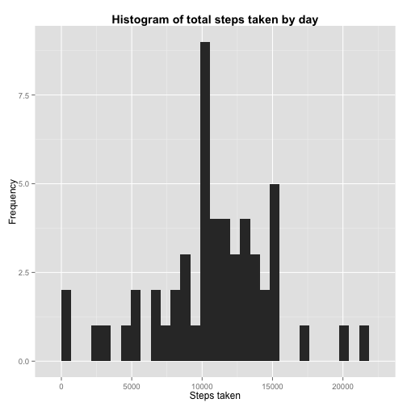
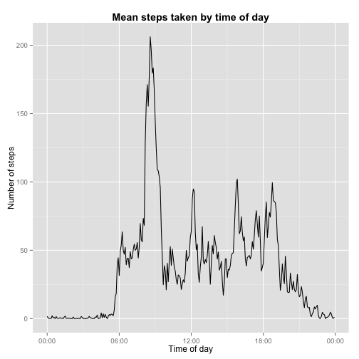
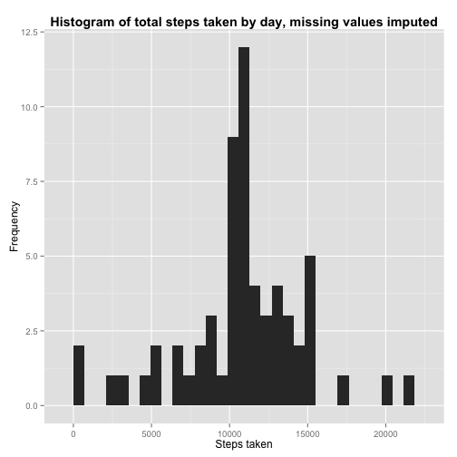
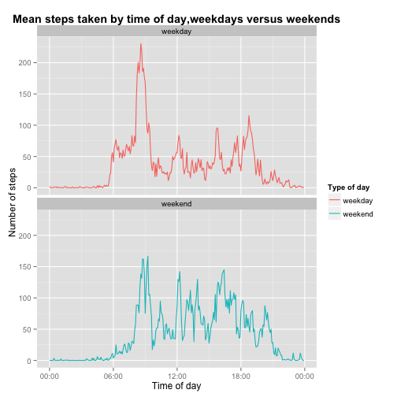

##Loading data

First we read in the data.


```r
library(ggplot2)
PATH <- "~/Documents/Code/R/reproducibleresearch/project1/RepData_PeerAssessment1/"
setwd(PATH)
activity <- read.csv("activity.csv", stringsAsFactors = F)
```

```
## Warning in file(file, "rt"): cannot open file 'activity.csv': No such file
## or directory
```

```
## Error in file(file, "rt"): cannot open the connection
```

```r
summary(activity)
```

```
##      steps            date              interval     
##  Min.   :  0.00   Length:17568       Min.   :   0.0  
##  1st Qu.:  0.00   Class :character   1st Qu.: 588.8  
##  Median :  0.00   Mode  :character   Median :1177.5  
##  Mean   : 37.38                      Mean   :1177.5  
##  3rd Qu.: 12.00                      3rd Qu.:1766.2  
##  Max.   :806.00                      Max.   :2355.0  
##  NA's   :2304
```

The data do not need further processing at this time. We will process the data for each task when it becomes necessary.

##Total steps per day

We now investigate the total steps per day, make a histogram, and compute the mean and median total steps per day.

Next we aggregate steps taken by day, ignoring NA values for now. Note that the aggregate function removes NA values for us. Thus if a day has only NA values, it will not appear in the aggregated data frame or the histogram or mean or median that follow.


```r
act_by_day <- aggregate(steps ~ date, data = activity, FUN = sum)
```

Now we plot a histogram of the total number of steps taken each day.


```r
ggplot(data = act_by_day, aes(x = steps)) +
    geom_histogram() +
    xlab("Steps taken") +
    ylab("Frequency") +
    ggtitle("Histogram of total steps taken by day") +
    theme(plot.title = element_text(face = "bold"))
```

 

Next we compute the mean and median of the total steps taken by day:


```r
mean(act_by_day$steps)
```

```
## [1] 10766.19
```

```r
median(act_by_day$steps)
```

```
## [1] 10765
```

-------

##Average Daily Activity

We now investigate daily average activity by time of day.

First we find the average the steps taken by 5-minute interval, averaged across all days. Then we extract the time of day from the interval field.


```r
act_time <- aggregate(steps ~ interval, data = activity, FUN = mean)
act_time$time <- paste(act_time$interval %/% 100, 
                       act_time$interval - 100 * (act_time$interval %/% 100), sep = ":")
act_time$time <- as.POSIXct(strptime(act_time$time, "%H:%M"))
```

Now we are set to make a time-series plot of the average number of steps taken by 5-minute interval.


```r
require("scales")
ggplot(data = act_time, aes(x = time, y = steps)) +
    geom_line() +
    ggtitle("Mean steps taken by time of day") +
    xlab("Time of day") +
    ylab("Number of steps") +
    scale_color_discrete(name = "Type of day") +
    scale_x_datetime(labels = date_format("%H:%M")) +
    theme(plot.title = element_text(face = "bold"))
```

 

Finally, we determine which 5-minute interval contains the maximum average number of steps:


```r
max_steps <- max(act_time$steps)
max_steps     # maximum average step count in a 5-minute interval
```

```
## [1] 206.1698
```

```r
max_index <- which(act_time$steps == max_steps)
max_interval <- act_time$interval[max_index]
max_interval # interval in which this maximum occurred
```

```
## [1] 835
```

-------

##Imputing values

Now we go back to the unaggregated dataset. There are a lot of data missing. Here are the number of missing values, as well as the total entries (including missing values), plus the number of missing values by day.


```r
missing <- is.na(activity$steps)
sum(missing)        # Missing values
```

```
## [1] 2304
```

```r
nrow(activity)      # Total entries
```

```
## [1] 17568
```

```r
na_counts <- tapply(activity$steps, activity$date, function(x) {sum(is.na(x))})
na_counts[na_counts != 0]   # table with NA count by day, for days with non-zero NA count
```

```
## 2012-10-01 2012-10-08 2012-11-01 2012-11-04 2012-11-09 2012-11-10 
##        288        288        288        288        288        288 
## 2012-11-14 2012-11-30 
##        288        288
```

We see that the days that have missing values are in fact entirely missing --- 288 missing 5-minute intervals is a whole day, as 288 = 24 * 60 / 5.

Let's impute these values based on the average steps taken at that time of day. First we take the mean of the non-missing data grouped by the 5-minute intervals, rounded to the nearest integer. Then we impute missing values as this rounded mean for the appropriate 5-minute interval.


```r
act_by_time <- tapply(activity$steps, activity$interval, 
                    FUN = function(x) {round(mean(x, na.rm = T))})

lookup <- function(x) {
    # imputes values by looking them up in act_by_time
    # x[1] is steps, x[2] is interval
    if (!is.na(x[1])) {
        return(x[1])
    } else {
        # as.character allows us to access act_by_time by key
        return(act_by_time[as.character(x[2])])  
    }
}

# impute values
act_filled <- activity
act_filled$steps <- apply(act_filled[,c(1,3)], 1, lookup)
```

Now we make a histogram again, with the missing values filled in, and compute the mean and median of the total steps taken by day, with missing values imputed:


```r
act_by_day_filled <- aggregate(steps ~ date, data = act_filled, FUN = sum)
ggplot(data = act_by_day_filled, aes(x = steps)) +
    geom_histogram() +
    xlab("Steps taken") +
    ylab("Frequency") +
    ggtitle("Histogram of total steps taken by day, missing values imputed") +
    theme(plot.title = element_text(face = "bold"))
```

 

In this histogram, compared to the first histogram, we can see more days added at the average --- in fact, 8 extra days corresponding to the ones in the na_counts table.


```r
mean(act_by_day_filled$steps)
```

```
## [1] 10765.64
```

```r
median(act_by_day_filled$steps)
```

```
## [1] 10762
```

The mean and median are very similar to their values with no imputation. In fact, the difference is due entirely to rounding to the nearest integer in our imputation. This is because, by the na_counts table above, only entire days were missing. Thus because we imputed based on average value at the given 5-minute interval, the overall average was not changed. Note that the aggregate function we used in the first section discarded missing values, and thus had no entries whatsoever for the days all of whose values were missing.

-------

##Weekdays versus weekends

Now we compare steps taken by time of day for weekdays and weekends, using our imputed data. Let's convert the date to POSIXlt and make a weekdays variable


```r
act_filled$date <- strptime(act_filled$date, "%Y-%m-%d")
act_filled$weekday <- weekdays(act_filled$date)
act_filled$isweekend <- act_filled$weekday == "Saturday" | act_filled$weekday == "Sunday"
act_filled$daytype <- factor(act_filled$isweekend, levels = c(FALSE, TRUE), labels = c("weekday", "weekend"))
```

Now we find the mean number of steps taken by time of day for weekends and for weekdays. Then we convert the interval to a time to make our plot axis label nicer, and then plot the mean steps taken by time of day, with weekdays and weekends separated.


```r
act_data <- aggregate(steps ~ interval + daytype, data = act_filled, FUN = mean)
act_data$time <- paste(act_data$interval %/% 100, 
                       act_data$interval - 100 * (act_data$interval %/% 100), sep = ":")
act_data$time <- as.POSIXct(strptime(act_data$time, "%H:%M"))

require("scales")
step_limits <- c(0, max(act_data$steps))
ggplot(data = act_data, aes(x = time, y = steps, col = daytype)) +
    geom_line() +
    facet_wrap(~ daytype, ncol = 1) +
    ggtitle("Mean steps taken by time of day,weekdays versus weekends") +
    xlab("Time of day") +
    ylab("Number of steps") +
    scale_color_discrete(name = "Type of day") +
    scale_x_datetime(labels = date_format("%H:%M")) +
    scale_y_continuous(limits = step_limits) +
    theme(plot.title = element_text(face = "bold"))
```

 
